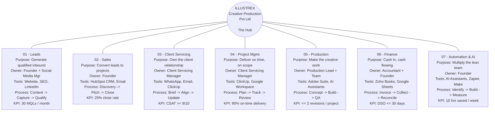

# ILLUSTREX Hub Map

Central Node: ILLUSTREX Creative Production Pvt Ltd (The Hub)

## 01 - Leads
- Purpose: Generate qualified inbound
- Owner: Founder + Social Media Mgr
- Tools: Website, SEO, LinkedIn
- Process: Content -> Capture -> Qualify
- KPI: 30 MQLs / month

## 02 - Sales
- Purpose: Convert leads to projects
- Owner: Founder
- Tools: HubSpot CRM, Email
- Process: Discovery -> Pitch -> Close
- KPI: 25% close rate

## 03 - Client Servicing
- Purpose: Own the client relationship
- Owner: Client Servicing Manager
- Tools: WhatsApp, Email, ClickUp
- Process: Brief -> Align -> Update
- KPI: CSAT >= 9/10

## 04 - Project Mgmt
- Purpose: Deliver on time, on scope
- Owner: Client Servicing Manager
- Tools: ClickUp, Google Workspace
- Process: Plan -> Track -> Review
- KPI: 90% on-time delivery

## 05 - Production
- Purpose: Make the creative work
- Owner: Production Lead + Team
- Tools: Adobe Suite, AI Assistants
- Process: Concept -> Build -> QA
- KPI: <= 2 revisions / project

## 06 - Finance
- Purpose: Cash in, cash flowing
- Owner: Accountant + Founder
- Tools: Zoho Books, Google Sheets
- Process: Invoice -> Collect -> Reconcile
- KPI: DSO <= 30 days

## 07 - Automation & AI
- Purpose: Multiply the lean team
- Owner: Founder
- Tools: AI Assistants, Zapier, Make
- Process: Identify -> Build -> Measure
- KPI: 10 hrs saved / week
